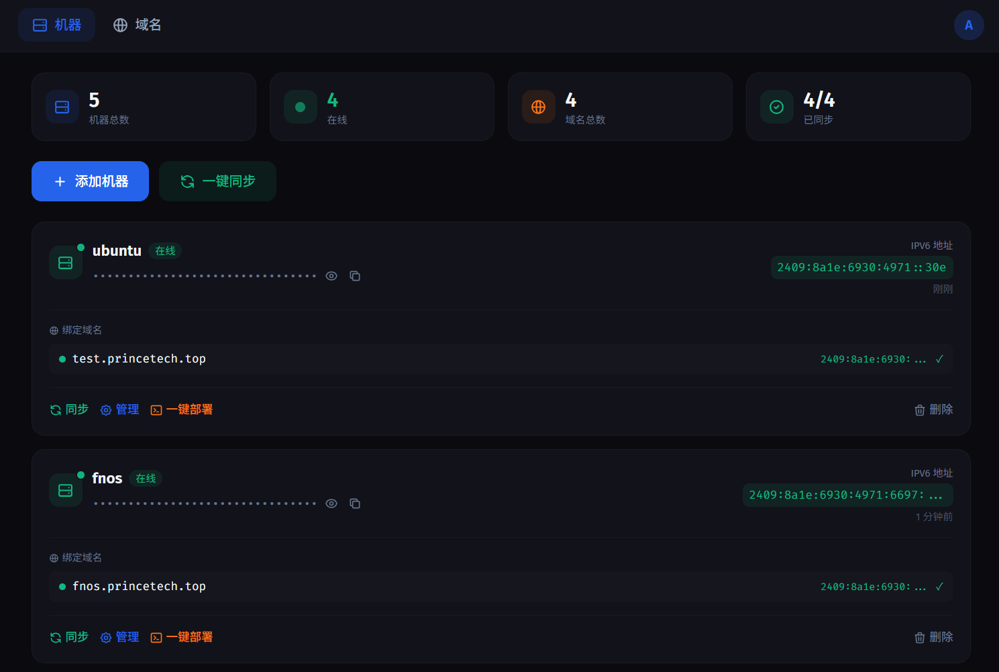
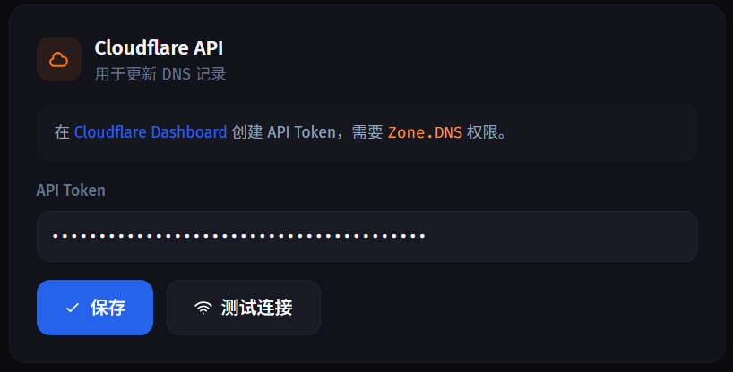
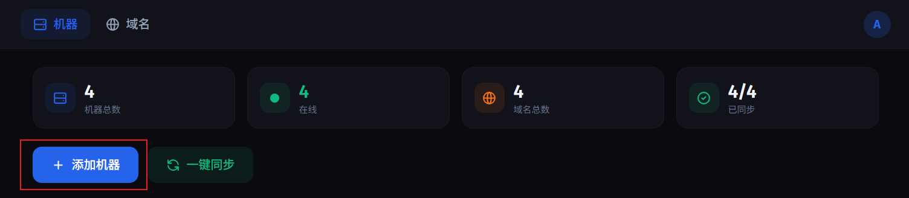
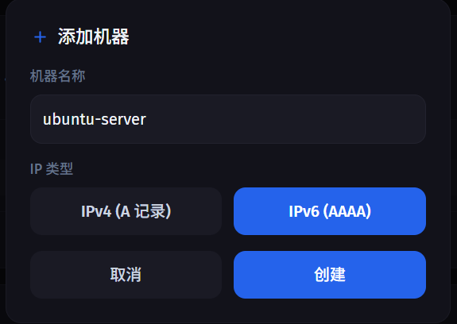
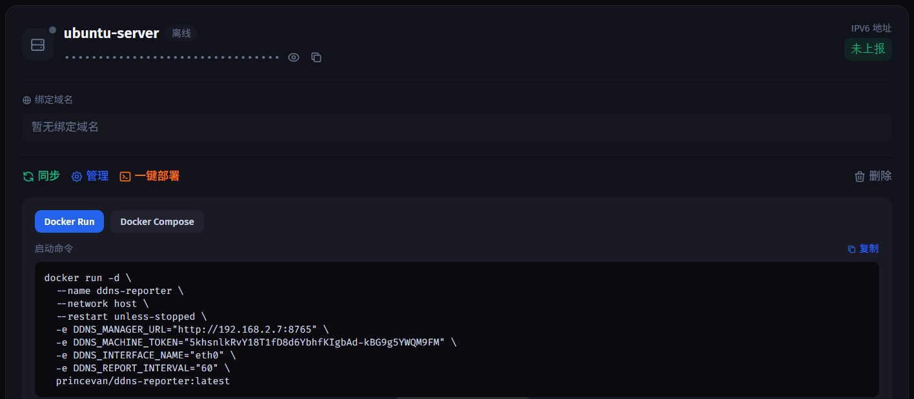

# DDNS Manager

[Lucky](https://github.com/gdy666/lucky)和[ddns-go](https://github.com/jeessy2/ddns-go)都是非常优秀的DDNS工具，但在内网设备比较多时，需要在每台机器上都部署lucky或ddns-go，单独配置token等管理起来较为繁琐，本项目是一个轻量级内网多设备DDNS管理工具，通过在一台机器上部署管理端（manager），其他机器部署轻量的上报端（reporter），一站式管理内网所有主机的DDNS

| 目前仅支持Cloudflare DDNS解析



## 功能介绍

- **多机器管理**：支持管理多台机器，每台机器独立 Token 认证
- **IPv6支持**：自动获取本机 IPv6 地址并上报
- **自动同步**：IP 变化时自动更新 Cloudflare DNS 解析记录
- **域名绑定**：一台机器可绑定多个域名，支持自动获取 Zone ID
- **实时状态**：在线状态检测、同步状态显示、IP 历史记录
- **Web管理界面**：深色/明亮主题切换、响应式设计、移动端适配

## 系统架构

- **管理端(manager)**：定时将内网机器的IP同步到DNS解析
- **上报端(reporter)**：定时将客户端机器的IP上报给管理端
- **架构特点：**
  - **上报端无状态**：单文件 Python 脚本，无需数据库，适合嵌入式设备
  - **管理端轻量**：FastAPI + SQLite，单容器部署，资源占用低
  - **解耦设计**：上报端与管理端分离，可独立部署、独立扩容

```
┌─────────────────┐         ┌─────────────────┐
│   上报端        │  HTTP   │    管理端       │
│  (reporter)     │ ──────> │   (manager)     │
│                 │         │                 │
│ - 获取本机IP    │         │ - Web UI        │
│ - 定时上报      │         │ - 机器/域名管理 │
│ - IPv4/IPv6 支持│         │ - DNS 同步      │
└─────────────────┘         └────────┬────────┘
                                     │
                                     │ API
                                     ▼
                            ┌─────────────────┐
                            │   Cloudflare    │
                            │   DNS API       │
                            └─────────────────┘
```

## 为什么选择 DDNS Manager？

| 特点 | 说明 |
|------|------|
| 🚀 **极速部署** | 一行 Docker 命令即可启动，无需复杂配置 |
| 📦 **镜像小巧** | 基于 python:3.12-slim，镜像体积小、启动快 |
| 🔐 **Token 认证** | 每台机器独立 Token，安全可靠 |
| 🎨 **现代 UI** | Vue 3 + Tailwind CSS，支持深色/明亮主题 |
| ⚡ **实时同步** | IP 变化即时更新 DNS，支持一键批量同步 |

### 与其他方案对比

| 方案 | 优点 | 缺点 |
|------|------|------|
| **ddns-go** | 功能全面、社区活跃 | Go 语言部署、配置相对复杂 |
| **Cloudflare DDNS 脚本** | 简单直接 | 无管理界面、多机器管理困难 |
| **DDNS Manager** | 轻量、Web UI、多机器管理 | 功能相对精简 |

## 快速开始

### 1. 部署管理端

##### Docker Compose(推荐)

首先创建`docker-compose.manager.yml`:

```yaml
services:
  ddns-manager:
    image: princevan/ddns-manager:latest
    container_name: ddns-manager
    restart: unless-stopped
    ports:
      - "8765:8000"
    volumes:
      - ddns-data:/data
    environment:
      - DDNS_ADMIN_USERNAME=admin
      - DDNS_ADMIN_PASSWORD=yourpassword
volumes:
  ddns-data:
```

启动manager
```bash
docker compose -f docker-compose.manager.yml up -d
```

<details>
<summary><strong>docker run命令</strong></summary>

```bash
docker run -d \
  --name ddns-manager \
  -p 8765:8000 \
  -v ddns-data:/data \
  -e DDNS_ADMIN_USERNAME=yourusername \
  -e DDNS_ADMIN_PASSWORD=yourpassword \
  princevan/ddns-manager:latest
```
</details>

### 2. 创建机器

访问 `http://your-ip:8765`，登录管理端后，配置 Cloudflare Token



选择创建机器:


填写机器名和选择IP类型:


点击【一键部署】复制docker-run或docker-compose命令到内网机器部署。注意替换命令中的网卡名，否则可能上报失败。


### 3. 部署上报端

**docker-compose**

首先创建docker-compose.reporter.yml
```yaml
services:
  ddns-reporter:
    image: princevan/ddns-reporter:latest
    container_name: ddns-reporter
    restart: unless-stopped
    network_mode: host
    environment:
      - DDNS_MANAGER_URL=http://your-ip:8765
      - DDNS_MACHINE_TOKEN=machine-token
      - DDNS_INTERFACE_NAME=eth0  # 替换成对应网卡名
      - DDNS_REPORT_INTERVAL=60
```
<details>
<summary><strong>docker run</strong></summary>

```bash
docker run -d \
  --name ddns-reporter \
  --network host \
  --restart unless-stopped \
  -e DDNS_MANAGER_URL=http://your-manager-ip:8765 \
  -e DDNS_MACHINE_TOKEN=your-token \
  -e DDNS_INTERFACE_NAME=eth0 \
  -e DDNS_REPORT_INTERVAL=60 \
  princevan/ddns-reporter:latest
```

- 注意：上报端使用 `--network host` 以便访问宿主机网卡获取 IPv6 地址。
</details>


## 本地部署（不推荐）

### 环境要求

- Python 3.10+
- SQLite

### 安装依赖

```bash
python -m venv .venv
source .venv/bin/activate
pip install -r requirements.txt
```

### 启动管理端

```bash
export DDNS_ADMIN_USERNAME=admin
export DDNS_ADMIN_PASSWORD=yourpassword

uvicorn app.main:app --host 0.0.0.0 --port 8765
```

### 启动上报端

```bash
export DDNS_MANAGER_URL=http://your-manager-ip:8765
export DDNS_MACHINE_TOKEN=your-token
export DDNS_INTERFACE_NAME=eth0
export DDNS_REPORT_INTERVAL=60

python reporter.py
```

---

## 使用说明

1. 打开管理端，登录后创建机器，获取 Token
2. 在目标机器部署上报端，配置环境变量
3. 在管理端设置页面配置 Cloudflare API Token
4. 给机器绑定域名（Zone ID 自动获取）
5. 点击「同步」手动同步，或等待上报端自动更新

---

## 环境变量

### 管理端

| 变量 | 必需 | 默认值 | 说明 |
|------|------|--------|------|
| `DDNS_ADMIN_USERNAME` | ✅ | - | 管理员用户名 |
| `DDNS_ADMIN_PASSWORD` | ✅ | - | 管理员密码 |
| `DDNS_DB_PATH` | ❌ | ./data/ddns.sqlite | 数据库路径 |

### 上报端

| 变量 | 必需 | 默认值 | 说明 |
|------|------|--------|------|
| `DDNS_MANAGER_URL` | ✅ | - | 管理端地址 |
| `DDNS_MACHINE_TOKEN` | ✅ | - | 机器 Token |
| `DDNS_INTERFACE_NAME` | ✅ | eth0 | 网卡名称 |
| `DDNS_REPORT_INTERVAL` | ❌ | 3600 | 上报间隔（秒） |